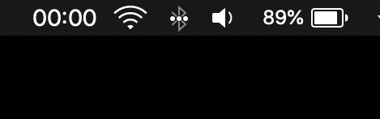
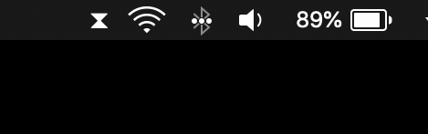

# A simple timer that lives in your menubar.

Timebar is a lightweight timer with a minimal, intuitive user interface. You can start, stop or reset Timebar right from your menubar.

If you find yourself constantly watching the time, Timebar also lets you discretely track time in the background.

## Features

### Basic

- [x] Records time
- [x] Displays timer in real-time
- [x] Option to continue or reset

### User Interface

- [x] Display timer in menu bar
- [x] Start and stop timer from menu bar
- [x] Option to hide elapsed time in menu bar

### Productivity

- [ ] Reminds you to take breaks at set intervals
- [ ] Create custom intervals
- [ ] Track time by project
- [ ] Create custom projects
- [ ] Save user settings locally
